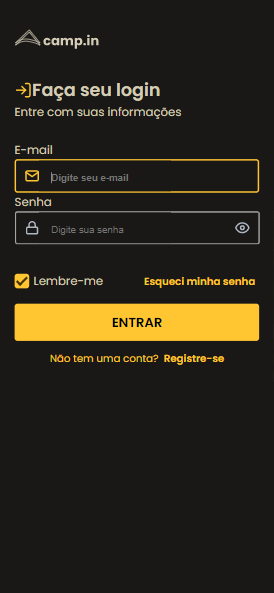

<h1 align="center"> Login Form </h1>

Aplicação desenvolvida para submissão no discover, programa para ensino de tecnologias WEB promovido pela Rocketseat .

🔗 <a href="https://johnwilker.github.io/loginForm">Clique aqui para acessar a página do projeto</a>

  <a href="#-tecnologias">Tecnologias</a>&nbsp;&nbsp;&nbsp;|&nbsp;&nbsp;&nbsp;
  <a href="#-projeto">Projeto</a>&nbsp;&nbsp;&nbsp;|&nbsp;&nbsp;&nbsp;
  <a href="#-layout">Layout</a>

 

  <strong>Desktop</strong>
  

  
  <strong>Mobile</strong> 
  

## 🚀 Tecnologias

Esse projeto foi desenvolvido com as seguintes tecnologias:

- HTML
- CSS

## 💻 Projeto

O loginForm é uma landing page que simula o preenchimento de dados para acessar uma conta, criar ou recuperar os dados de uma conta já existente, onde temos a atualização de ícones ao dar foco aos inputs usando CSS puro, além de opção de layout responsivo para dispositivos móveis.

## 🔖 Layout

Você pode visualizar o layout do projeto através [DESSE LINK](https://www.figma.com/file/or5cOMDioLXCISVI0g46YP/DD-%2F-Login-Form---CSS?node-id=216%3A2). É necessário ter conta no [Figma](https://figma.com) para acessá-lo.

---

Feito com ♥ by John :wave: [Participe da comunidade Rocketseat!](https://discord.gg/rocketseat)
